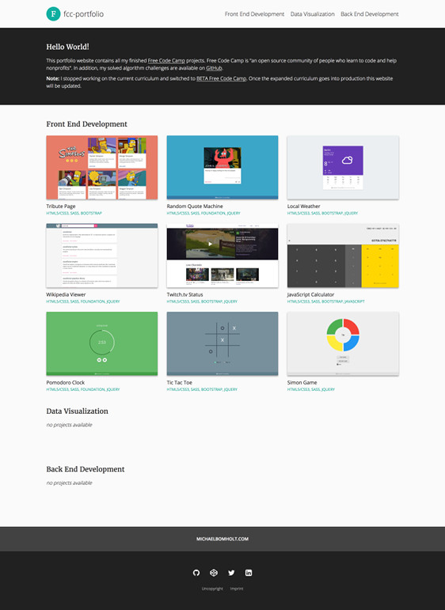
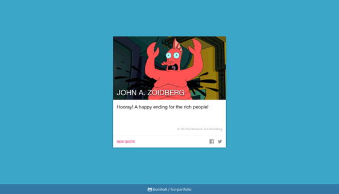
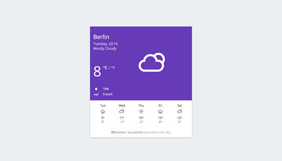
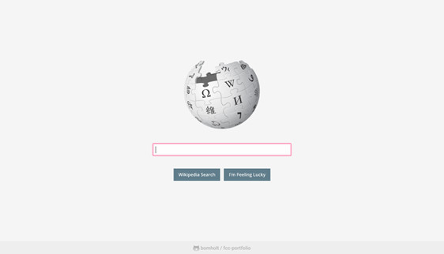
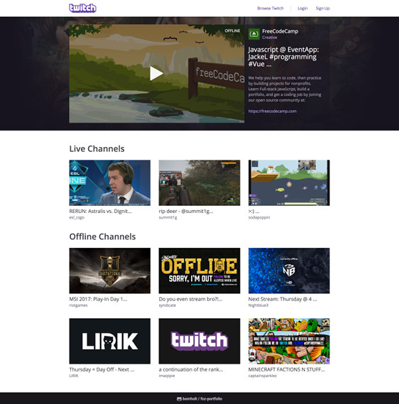
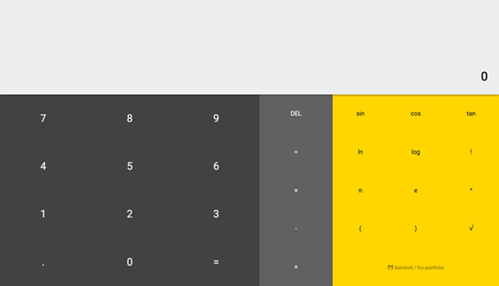

# FCC Portfolio

This repository contains all my finished [Free Code Camp](https://www.freecodecamp.com) projects and solved algorithm challenges. Free Code Camp is "an open source community of people who learn to code and help nonprofits".

**Note:** I stopped working on the current curriculum and switched to [BETA Free Code Camp](https://beta.freecodecamp.com). Once the expanded curriculum goes into production this repository will be updated.

*Projects:*
- [x] [Front End Development](https://github.com/bomholt/fcc-portfolio#front-end-development) **(10/10)**
- [ ] [~~Data Visualization~~](https://github.com/bomholt/fcc-portfolio#data-visualization) **~~(0/10)~~**
- [ ] [~~Back End Development~~](https://github.com/bomholt/fcc-portfolio#back-end-development) **~~(0/10)~~**

*Challenges:*
- [x] [Basic Algorithm Scripting](https://github.com/bomholt/fcc-portfolio/tree/master/basic_algorithm_scripting) **(16/16)**
- [x] [Intermediate Algorithm Scripting](https://github.com/bomholt/fcc-portfolio/tree/master/intermediate_algorithm_scripting) **(21/21)**
- [x] [Advanced Algorithm Scripting](https://github.com/bomholt/fcc-portfolio/tree/master/advanced_algorithm_scripting) **(9/9)**

## Front End Development

* [**Basic Front End Development Projects**](https://github.com/bomholt/fcc-portfolio/tree/master/basic_front_end_development_projects)
    * [Build a Tribute Page](https://michaelbomholt.com/fcc-portfolio/basic_front_end_development_projects/tribute_page)

        

    * [Build a Personal Portfolio Webpage](https://michaelbomholt.com/fcc-portfolio)

        

* [**Intermediate Front End Development Projects**](https://github.com/bomholt/fcc-portfolio/tree/master/intermediate_front_end_development_projects)
    * [Build a Random Quote Machine](https://michaelbomholt.com/fcc-portfolio/intermediate_front_end_development_projects/random_quote_machine)

        

    * [Show the Local Weather](https://michaelbomholt.com/fcc-portfolio/intermediate_front_end_development_projects/local_weather)

        

    * [Build a Wikipedia Viewer](https://michaelbomholt.com/fcc-portfolio/intermediate_front_end_development_projects/wikipedia_viewer)

        

    * [Use the Twitch.tv JSON API](https://michaelbomholt.com/fcc-portfolio/intermediate_front_end_development_projects/twitch_status)

        

* [**Advanced Front End Development Projects**](https://github.com/bomholt/fcc-portfolio/tree/master/advanced_front_end_development_projects)
    * [Build a JavaScript Calculator](https://michaelbomholt.com/fcc-portfolio/advanced_front_end_development_projects/js_calculator)

        

    * [Build a Pomodoro Clock](https://michaelbomholt.com/fcc-portfolio/advanced_front_end_development_projects/pomodoro_clock)

        

    * [Build a Tic Tac Toe Game](https://michaelbomholt.com/fcc-portfolio/advanced_front_end_development_projects/tic_tac_toe)

        

    * [Build a Simon Game](https://michaelbomholt.com/fcc-portfolio/advanced_front_end_development_projects/simon_game)

        

## Data Visualization

*no projects available*

## Back End Development

*no projects available*
