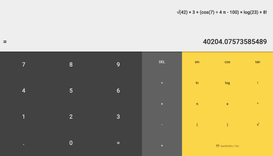

# freeCodeCamp: Learn to Code and Help Nonprofits

My solutions to exercise projects and algorithm challenges offered by [freeCodeCamp](https://www.freecodecamp.org)

**Note:** After having successfully completed freeCodeCamp's [Front End Development Program](https://www.freecodecamp.org/bomholtm/front-end-certification), I stopped working on the current curriculum and switched to the [freeCodeCamp beta](https://beta.freecodecamp.org).

### Table of Contents

***New Certificates***

- [ ] [Responsive Web Design](https://github.com/bomholtm/fcc#responsive-web-design)
- [x] [Algorithms and Data Structures](https://github.com/bomholtm/fcc#algorithms-and-data-structures)
- [ ] Front End Libraries
- [ ] Data Visualization
- [ ] API and Microservices
- [ ] Information Security and Quality Assurance

***Old Certificates***

- [x] [Legacy Front End Development](https://github.com/bomholtm/fcc#legacy-front-end-development)
- [ ] ~~Legacy Data Visualization~~
- [ ] ~~Legacy Back End Development~~

&nbsp;

## Responsive Web Design

* [Build a Survey Form](https://bomholtm.github.io/fcc/applied_responsive_web_design_projects/survey_form)

  

* [Build a Technical Documentation Page](https://bomholtm.github.io/fcc/applied_responsive_web_design_projects/documentation_page)

  

&nbsp;

## Algorithms and Data Structures

* [Convert Celsius to Fahrenheit](https://github.com/bomholtm/fcc/tree/master/algorithms_and_data_structures/convert_celsius_to_fahrenheit.js)
* [Reverse a String](https://github.com/bomholtm/fcc/tree/master/algorithms_and_data_structures/reverse_a_string.js)
* [Factorialize a Number](https://github.com/bomholtm/fcc/tree/master/algorithms_and_data_structures/factorialize_a_number.js)
* [Find the Longest Word in a String](https://github.com/bomholtm/fcc/tree/master/algorithms_and_data_structures/find_the_longest_word_in_a_string.js)
* [Return Largest Numbers in Arrays](https://github.com/bomholtm/fcc/tree/master/algorithms_and_data_structures/return_largest_numbers_in_arrays.js)
* [Confirm the Ending](https://github.com/bomholtm/fcc/tree/master/algorithms_and_data_structures/confirm_the_ending.js)
* [Repeat a String Repeat a String](https://github.com/bomholtm/fcc/tree/master/algorithms_and_data_structures/repeat_a_string_repeat_a_string.js)
* [Truncate a String](https://github.com/bomholtm/fcc/tree/master/algorithms_and_data_structures/truncate_a_string.js)
* [Finders Keepers](https://github.com/bomholtm/fcc/tree/master/algorithms_and_data_structures/finders_keepers.js)
* [Boo who](https://github.com/bomholtm/fcc/tree/master/algorithms_and_data_structures/boo_who.js)
* [Title Case a Sentence](https://github.com/bomholtm/fcc/tree/master/algorithms_and_data_structures/title_case_a_sentence.js)
* [Falsy Bouncer](https://github.com/bomholtm/fcc/tree/master/algorithms_and_data_structures/falsy_bouncer.js)
* [Where do I Belong](https://github.com/bomholtm/fcc/tree/master/algorithms_and_data_structures/where_do_i_belong.js)
* [Mutations](https://github.com/bomholtm/fcc/tree/master/algorithms_and_data_structures/mutations.js)
* [Chunky Monkey](https://github.com/bomholtm/fcc/tree/master/algorithms_and_data_structures/chunky_monkey.js)

&nbsp;

* [Palindrome Checker](https://github.com/bomholtm/fcc/tree/master/algorithms_and_data_structures/palindrome_checker.js)
* [Roman Numeral Converter](https://github.com/bomholtm/fcc/tree/master/algorithms_and_data_structures/roman_numeral_converter.js)
* [Caesars Cipher](https://github.com/bomholtm/fcc/tree/master/algorithms_and_data_structures/caesars_cipher.js)
* [Telephone Number Validator](https://github.com/bomholtm/fcc/tree/master/algorithms_and_data_structures/telephone_number_validator.js)
* [Cash Register](https://github.com/bomholtm/fcc/tree/master/algorithms_and_data_structures/cash_register.js)

&nbsp;

* [Sum All Numbers in a Range](https://github.com/bomholtm/fcc/tree/master/algorithms_and_data_structures/sum_all_numbers_in_a_range.js)
* [Diff Two Arrays](https://github.com/bomholtm/fcc/tree/master/algorithms_and_data_structures/diff_two_arrays.js)
* [Seek and Destroy](https://github.com/bomholtm/fcc/tree/master/algorithms_and_data_structures/seek_and_destroy.js)
* [Wherefore art thou](https://github.com/bomholtm/fcc/tree/master/algorithms_and_data_structures/wherefore_art_thou.js)
* [Spinal Tap Case](https://github.com/bomholtm/fcc/tree/master/algorithms_and_data_structures/spinal_tap_case.js)
* [Pig Latin](https://github.com/bomholtm/fcc/tree/master/algorithms_and_data_structures/pig_latin.js)
* [Search and Replace](https://github.com/bomholtm/fcc/tree/master/algorithms_and_data_structures/search_and_replace.js)
* [DNA Pairing](https://github.com/bomholtm/fcc/tree/master/algorithms_and_data_structures/dna_pairing.js)
* [Missing letters](https://github.com/bomholtm/fcc/tree/master/algorithms_and_data_structures/missing_letters.js)
* [Sorted Union](https://github.com/bomholtm/fcc/tree/master/algorithms_and_data_structures/sorted_union.js)
* [Convert HTML Entities](https://github.com/bomholtm/fcc/tree/master/algorithms_and_data_structures/convert_html_entities.js)
* [Sum All Odd Fibonacci Numbers](https://github.com/bomholtm/fcc/tree/master/algorithms_and_data_structures/sum_all_odd_fibonacci_numbers.js)
* [Sum All Primes](https://github.com/bomholtm/fcc/tree/master/algorithms_and_data_structures/sum_all_primes.js)
* [Smallest Common Multiple](https://github.com/bomholtm/fcc/tree/master/algorithms_and_data_structures/smallest_common_multiple.js)
* [Drop it](https://github.com/bomholtm/fcc/tree/master/algorithms_and_data_structures/drop_it.js)
* [Steamroller](https://github.com/bomholtm/fcc/tree/master/algorithms_and_data_structures/steamroller.js)
* [Binary Agents](https://github.com/bomholtm/fcc/tree/master/algorithms_and_data_structures/binary_agents.js)
* [Everything Be True](https://github.com/bomholtm/fcc/tree/master/algorithms_and_data_structures/everything_be_true.js)
* [Arguments Optional](https://github.com/bomholtm/fcc/tree/master/algorithms_and_data_structures/arguments_optional.js)
* [Make a Person](https://github.com/bomholtm/fcc/tree/master/algorithms_and_data_structures/make_a_person.js)
* [Map the Debris](https://github.com/bomholtm/fcc/tree/master/algorithms_and_data_structures/map_the_debris.js)

&nbsp;

## Legacy Front End Development

* [Build a Tribute Page](https://bomholtm.github.io/fcc/legacy_front_end_development/tribute_page)

  

* [Build a Personal Portfolio Webpage](https://bomholtm.github.io/fcc/legacy_front_end_development/personal_portfolio)

  

&nbsp;

* [Build a Random Quote Machine](https://bomholtm.github.io/fcc/legacy_front_end_development/random_quote_machine)

  

* [Show the Local Weather](https://bomholtm.github.io/fcc/legacy_front_end_development/local_weather)

  

* [Build a Wikipedia Viewer](https://bomholtm.github.io/fcc/legacy_front_end_development/wikipedia_viewer)

  

* [Use the Twitch.tv JSON API](https://bomholtm.github.io/fcc/legacy_front_end_development/twitch_status)

  

&nbsp;

* [Build a JavaScript Calculator](https://bomholtm.github.io/fcc/legacy_front_end_development/js_calculator)

  

* [Build a Pomodoro Clock](https://bomholtm.github.io/fcc/legacy_front_end_development/pomodoro_clock)

  

* [Build a Tic Tac Toe Game](https://bomholtm.github.io/fcc/legacy_front_end_development/tic_tac_toe)

  

* [Build a Simon Game](https://bomholtm.github.io/fcc/legacy_front_end_development/simon_game)

  
