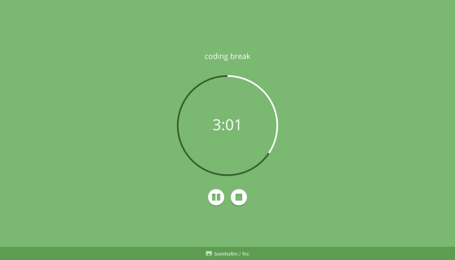
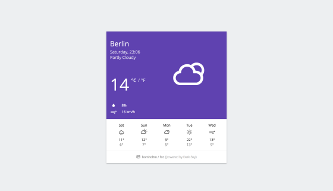
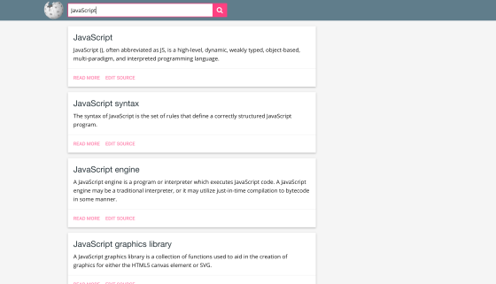
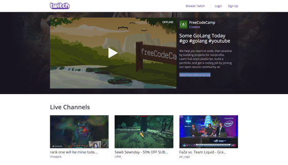

# FCC Portfolio

This repository contains all my finished [freeCodeCamp](https://www.freecodecamp.org) projects and solved algorithm challenges.

**Note:** After having successfully completed freeCodeCamp's [Front End Development Program](https://www.freecodecamp.org/bomholtm/front-end-certification), I stopped working on the current curriculum and switched to the [freeCodeCamp beta](https://beta.freecodecamp.org).

### Projects:

- [ ] **[Applied Responsive Web Design Projects](https://github.com/bomholtm/fcc-portfolio#applied-responsive-web-design-projects) (2/5)**
- [ ] **[Front End Frameworks Projects](https://github.com/bomholtm/fcc-portfolio#front-end-frameworks-projects) (3/5)**
- [ ] **[Data Visualization Projects](https://github.com/bomholtm/fcc-portfolio#data-visualization-projects) (0/5)**
- [ ] **[API and Microservice Projects](https://github.com/bomholtm/fcc-portfolio#api-and-microservice-projects) (0/5)**
- [ ] **[Information Security and Quality Assurance Projects](https://github.com/bomholtm/fcc-portfolio#information-security-and-quality-assurance-projects) (0/5)**

###### optional:

- [ ] [Coding Interview Take-home Projects](https://github.com/bomholtm/fcc-portfolio#coding-interview-take-home-projects) (5)

### Challenges:

- [x] **[Basic Algorithm Scripting](https://github.com/bomholtm/fcc-portfolio#basic-algorithm-scripting) (15/15)**
- [x] **[Intermediate Algorithm Scripting](https://github.com/bomholtm/fcc-portfolio#intermediate-algorithm-scripting) (24/24)**

###### optional:

- [ ] [Coding Interview Algorithm Questions](https://github.com/bomholtm/fcc-portfolio#coding-interview-algorithm-questions) (6)
- [ ] [Project Euler Problems](https://github.com/bomholtm/fcc-portfolio#project-euler-problems) (0)

## Applied Responsive Web Design Projects

* [Build a Tribute Page](https://michaelbomholt.com/fcc-portfolio/applied_responsive_web_design_projects/tribute_page)

  

* Build a Survey Form

* Build a Product Landing Page

* Build a Technical Documentation Page

* [Build a Personal Portfolio Webpage](https://michaelbomholt.com/fcc-portfolio/applied_responsive_web_design_projects/personal_portfolio)

  

## Basic Algorithm Scripting

* [Convert Celsius to Fahrenheit](https://github.com/bomholtm/fcc-portfolio/tree/master/basic_algorithm_scripting/01_convert_celsius_to_fahrenheit.js)
* [Reverse a String](https://github.com/bomholtm/fcc-portfolio/tree/master/basic_algorithm_scripting/02_reverse_a_string.js)
* [Factorialize a Number](https://github.com/bomholtm/fcc-portfolio/tree/master/basic_algorithm_scripting/03_factorialize_a_number.js)
* [Find the Longest Word in a String](https://github.com/bomholtm/fcc-portfolio/tree/master/basic_algorithm_scripting/04_find_the_longest_word_in_a_string.js)
* [Return Largest Numbers in Arrays](https://github.com/bomholtm/fcc-portfolio/tree/master/basic_algorithm_scripting/05_return_largest_numbers_in_arrays.js)
* [Confirm the Ending](https://github.com/bomholtm/fcc-portfolio/tree/master/basic_algorithm_scripting/06_confirm_the_ending.js)
* [Repeat a String Repeat a String](https://github.com/bomholtm/fcc-portfolio/tree/master/basic_algorithm_scripting/07_repeat_a_string_repeat_a_string.js)
* [Truncate a String](https://github.com/bomholtm/fcc-portfolio/tree/master/basic_algorithm_scripting/08_truncate_a_string.js)
* [Finders Keepers](https://github.com/bomholtm/fcc-portfolio/tree/master/basic_algorithm_scripting/09_finders_keepers.js)
* [Boo who](https://github.com/bomholtm/fcc-portfolio/tree/master/basic_algorithm_scripting/10_boo_who.js)
* [Title Case a Sentence](https://github.com/bomholtm/fcc-portfolio/tree/master/basic_algorithm_scripting/11_title_case_a_sentence.js)
* [Falsy Bouncer](https://github.com/bomholtm/fcc-portfolio/tree/master/basic_algorithm_scripting/12_falsy_bouncer.js)
* [Where do I Belong](https://github.com/bomholtm/fcc-portfolio/tree/master/basic_algorithm_scripting/13_where_do_i_belong.js)
* [Mutations](https://github.com/bomholtm/fcc-portfolio/tree/master/basic_algorithm_scripting/14_mutations.js)
* [Chunky Monkey](https://github.com/bomholtm/fcc-portfolio/tree/master/basic_algorithm_scripting/15_chunky_monkey.js)

## Intermediate Algorithm Scripting

* [Sum All Numbers in a Range](https://github.com/bomholtm/fcc-portfolio/tree/master/intermediate_algorithm_scripting/01_sum_all_numbers_in_a_range.js)
* [Diff Two Arrays](https://github.com/bomholtm/fcc-portfolio/tree/master/intermediate_algorithm_scripting/02_diff_two_arrays.js)
* [Check for Palindromes](https://github.com/bomholtm/fcc-portfolio/tree/master/intermediate_algorithm_scripting/03_check_for_palindromes.js)
* [Seek and Destroy](https://github.com/bomholtm/fcc-portfolio/tree/master/intermediate_algorithm_scripting/04_seek_and_destroy.js)
* [Wherefore art thou](https://github.com/bomholtm/fcc-portfolio/tree/master/intermediate_algorithm_scripting/05_wherefore_art_thou.js)
* [Spinal Tap Case](https://github.com/bomholtm/fcc-portfolio/tree/master/intermediate_algorithm_scripting/06_spinal_tap_case.js)
* [Roman Numeral Converter](https://github.com/bomholtm/fcc-portfolio/tree/master/intermediate_algorithm_scripting/07_roman_numeral_converter.js)
* [Caesars Cipher](https://github.com/bomholtm/fcc-portfolio/tree/master/intermediate_algorithm_scripting/08_caesars_cipher.js)
* [Pig Latin](https://github.com/bomholtm/fcc-portfolio/tree/master/intermediate_algorithm_scripting/09_pig_latin.js)
* [Search and Replace](https://github.com/bomholtm/fcc-portfolio/tree/master/intermediate_algorithm_scripting/10_search_and_replace.js)
* [DNA Pairing](https://github.com/bomholtm/fcc-portfolio/tree/master/intermediate_algorithm_scripting/11_dna_pairing.js)
* [Missing letters](https://github.com/bomholtm/fcc-portfolio/tree/master/intermediate_algorithm_scripting/12_missing_letters.js)
* [Sorted Union](https://github.com/bomholtm/fcc-portfolio/tree/master/intermediate_algorithm_scripting/13_sorted_union.js)
* [Convert HTML Entities](https://github.com/bomholtm/fcc-portfolio/tree/master/intermediate_algorithm_scripting/14_convert_html_entities.js)
* [Sum All Odd Fibonacci Numbers](https://github.com/bomholtm/fcc-portfolio/tree/master/intermediate_algorithm_scripting/15_sum_all_odd_fibonacci_numbers.js)
* [Sum All Primes](https://github.com/bomholtm/fcc-portfolio/tree/master/intermediate_algorithm_scripting/16_sum_all_primes.js)
* [Smallest Common Multiple](https://github.com/bomholtm/fcc-portfolio/tree/master/intermediate_algorithm_scripting/17_smallest_common_multiple.js)
* [Drop it](https://github.com/bomholtm/fcc-portfolio/tree/master/intermediate_algorithm_scripting/18_drop_it.js)
* [Steamroller](https://github.com/bomholtm/fcc-portfolio/tree/master/intermediate_algorithm_scripting/19_steamroller.js)
* [Binary Agents](https://github.com/bomholtm/fcc-portfolio/tree/master/intermediate_algorithm_scripting/20_binary_agents.js)
* [Everything Be True](https://github.com/bomholtm/fcc-portfolio/tree/master/intermediate_algorithm_scripting/21_everything_be_true.js)
* [Arguments Optional](https://github.com/bomholtm/fcc-portfolio/tree/master/intermediate_algorithm_scripting/22_arguments_optional.js)
* [Make a Person](https://github.com/bomholtm/fcc-portfolio/tree/master/intermediate_algorithm_scripting/23_make_a_person.js)
* [Map the Debris](https://github.com/bomholtm/fcc-portfolio/tree/master/intermediate_algorithm_scripting/24_map_the_debris.js)

## Front End Frameworks Projects

* [Build a Random Quote Machine](https://michaelbomholt.com/fcc-portfolio/front_end_frameworks_projects/random_quote_machine)

  

* Build a Markdown Previewer

* Build a Drum Machine

* [Build a JavaScript Calculator](https://michaelbomholt.com/fcc-portfolio/front_end_frameworks_projects/js_calculator)

  

* [Build a Pomodoro Clock](https://michaelbomholt.com/fcc-portfolio/front_end_frameworks_projects/pomodoro_clock)

  

## Data Visualization Projects

* Visualize Data with a Bar Chart
* Visualize Data with a Scatterplot Graph
* Visualize Data with a Heat Map
* Visualize Data with a Choropleth Map
* Visualize Data with a Treemap Diagram

## API and Microservice Projects

* Timestamp Microservice
* Request Header Parser Microservice
* URL Shortener Microservice
* Exercise Tracker
* File Metadata Microservice

## Information Security and Quality Assurance Projects

* Metric-Imperial Converter
* Issue Tracker
* Personal Library
* Stock Price Checker
* Anonymous Message Board

## Coding Interview Algorithm Questions

* [Validate US Telephone Numbers](https://github.com/bomholtm/fcc-portfolio/tree/master/coding_interview_algorithm_questions/01_validate_us_telephone_numbers.js)
* [Symmetric Difference](https://github.com/bomholtm/fcc-portfolio/tree/master/coding_interview_algorithm_questions/02_symmetric_difference.js)
* [Exact Change](https://github.com/bomholtm/fcc-portfolio/tree/master/coding_interview_algorithm_questions/03_exact_change.js)
* [Inventory Update](https://github.com/bomholtm/fcc-portfolio/tree/master/coding_interview_algorithm_questions/04_inventory_update.js)
* [No Repeats Please](https://github.com/bomholtm/fcc-portfolio/tree/master/coding_interview_algorithm_questions/05_no_repeats_please.js)
* [Pairwise](https://github.com/bomholtm/fcc-portfolio/tree/master/coding_interview_algorithm_questions/06_pairwise.js)

## Project Euler

## Coding Interview Take-home Projects

* [Show the Local Weather](https://michaelbomholt.com/fcc-portfolio/coding_interview_takehome_projects/local_weather)

  

* [Build a Wikipedia Viewer](https://michaelbomholt.com/fcc-portfolio/coding_interview_takehome_projects/wikipedia_viewer)

  

* [Use the Twitch.tv JSON API](https://michaelbomholt.com/fcc-portfolio/coding_interview_takehome_projects/twitch_status)

  

* [Build a Tic Tac Toe Game](https://michaelbomholt.com/fcc-portfolio/coding_interview_takehome_projects/tic_tac_toe)

  

* [Build a Simon Game](https://michaelbomholt.com/fcc-portfolio/coding_interview_takehome_projects/simon_game)

  
