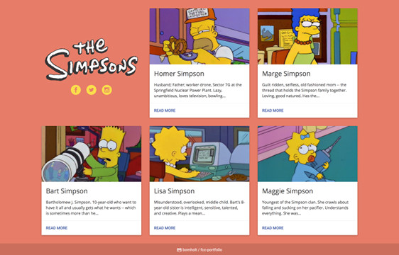
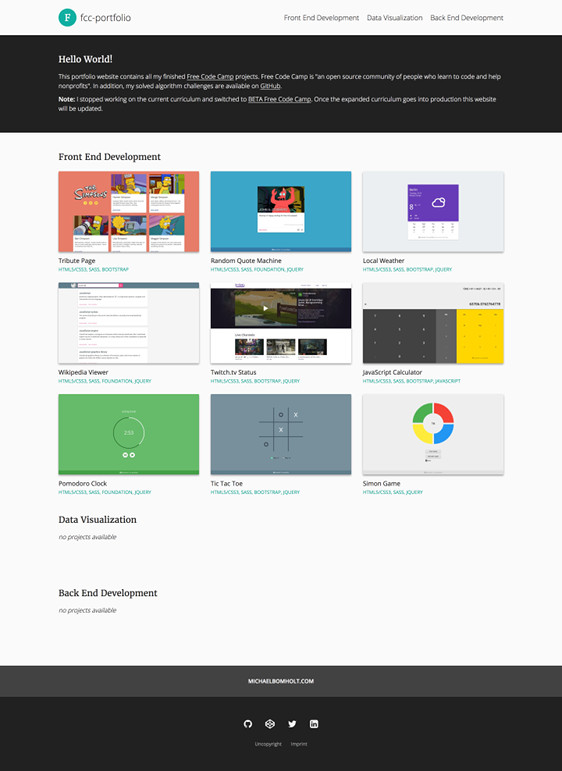
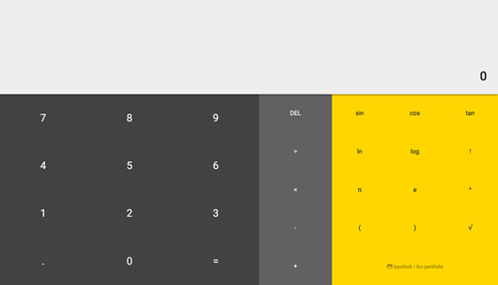
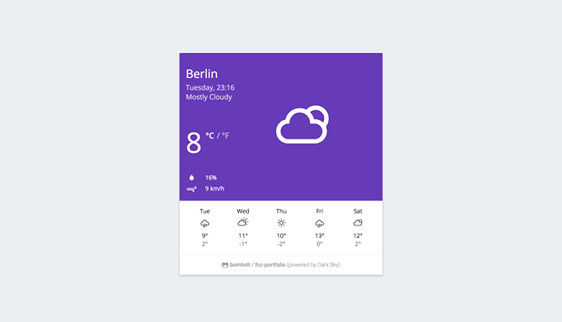
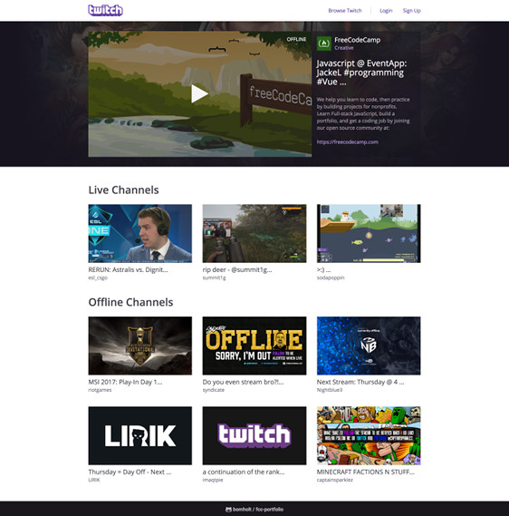

# FCC Portfolio (BETA)

*Projects:*
- [ ] [Applied Responsive Web Design Projects](https://github.com/bomholt/fcc-portfolio/tree/master/_beta/applied_responsive_web_design_projects) **(2/5)**
- [ ] [Front End Frameworks Projects](https://github.com/bomholt/fcc-portfolio/tree/master/_beta/front_end_frameworks_projects) **(3/5)**
- [ ] [Data Visualization Projects](https://github.com/bomholt/fcc-portfolio/tree/master/_beta/data_visualization_projects) **(0/5)**
- [ ] [Coding Interview Take-home Projects 1](https://github.com/bomholt/fcc-portfolio/tree/master/_beta/coding_interview_takehome_projects_1) **(3/11)**
- [ ] [API and Microservice Projects](https://github.com/bomholt/fcc-portfolio/tree/master/_beta/api_and_microservice_projects) **(0/5)**
- [ ] [Information Security and Quality Assurance Projects](https://github.com/bomholt/fcc-portfolio/tree/master/_beta/information_security_and_quality_assurance_projects) **(0/5)**
- [ ] [Coding Interview Take-home Projects 2](https://github.com/bomholt/fcc-portfolio/tree/master/_beta/coding_interview_takehome_projects_2) **(0/3)**

*Challenges:*
- [ ] [Basic Algorithm Scripting](https://github.com/bomholt/fcc-portfolio/tree/master/_beta/basic_algorithm_scripting) **(0/16)**
- [ ] [Intermediate Algorithm Scripting](https://github.com/bomholt/fcc-portfolio/tree/master/_beta/intermediate_algorithm_scripting) **(0/24)**
- [ ] [Coding Interview Algorithm Questions](https://github.com/bomholt/fcc-portfolio/tree/master/_beta/coding_interview_algorithm_questions) **(0/11)**

## Front End Development

* [**Applied Responsive Web Design Projects**](https://github.com/bomholt/fcc-portfolio/tree/master/_beta/applied_responsive_web_design_projects)
    * [Build a Tribute Page](https://michaelbomholt.com/fcc-portfolio/_beta/applied_responsive_web_design_projects/tribute_page)

        

    * Build a Survey Form
    * Build a Product Landing Page
    * Build a Technical Documentation Page
    * [Build a Personal Portfolio Webpage (v. 1.0)](https://michaelbomholt.com/fcc-portfolio/_beta/applied_responsive_web_design_projects/personal_portfolio)

        

* [**Front End Frameworks Projects**](https://github.com/bomholt/fcc-portfolio/tree/master/_beta/front_end_frameworks_projects)
    * [Build a Random Quote Machine](https://michaelbomholt.com/fcc-portfolio/_beta/front_end_frameworks_projects/random_quote_machine)

        

    * Build a Markdown Previewer
    * Build a Drum Machine
    * [Build a JavaScript Calculator](https://michaelbomholt.com/fcc-portfolio/_beta/front_end_frameworks_projects/js_calculator)

        

    * Build a Pomodoro Clock

* [**Data Visualization Projects**](https://github.com/bomholt/fcc-portfolio/tree/master/_beta/data_visualization_projects)
    * Visualize Data with a Bar Chart
    * Visualize Data with a Scatterplot Graph
    * Visualize Data with a Heat Map
    * Visualize Data with a Choropleth Map
    * Visualize Data with a Treemap Diagram

* [**Coding Interview Take-home Projects 1**](https://github.com/bomholt/fcc-portfolio/tree/master/_beta/coding_interview_takehome_projects_1)
    * [Show the Local Weather](https://michaelbomholt.com/fcc-portfolio/_beta/coding_interview_takehome_projects_1/local_weather)

        

    * [Build a Wikipedia Viewer](https://michaelbomholt.com/fcc-portfolio/_beta/coding_interview_takehome_projects_1/wikipedia_viewer)

        

    * [Use the Twitch.tv JSON API](https://michaelbomholt.com/fcc-portfolio/_beta/coding_interview_takehome_projects_1/twitch_status)

        

    * Build a Tic Tac Toe Game
    * Build a Simon Game
    * Build a Camper Leaderboard
    * Build a Recipe Box
    * Build the Game of Life
    * Build a Roguelike Dungeon Crawler Game
    * Show National Contiguity with a Force Directed Graph
    * Map Data Across the Globe

## Back End Development

* [**API and Microservice Projects**](https://github.com/bomholt/fcc-portfolio/tree/master/_beta/api_and_microservice_projects)
    * Timestamp Microservice
    * Request Header Parser Microservice
    * URL Shortener Microservice
    * Exercise Tracker
    * File Metadata Microservice

* [**Information Security and Quality Assurance Projects**](https://github.com/bomholt/fcc-portfolio/tree/master/_beta/information_security_and_quality_assurance_projects)
    * Metric-Imperial Converter
    * Issue Tracker
    * Personal Library
    * Stock Price Checker
    * Anonymous Message Board

* [**Coding Interview Take-home Projects 2**](https://github.com/bomholt/fcc-portfolio/tree/master/_beta/coding_interview_takehome_projects_2)
    * P2P Video Chat Application
    * Manage a Book Trading Club
    * Build a Pinterest Clone
